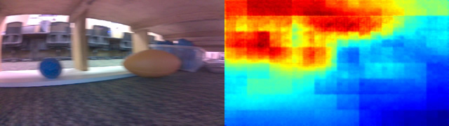
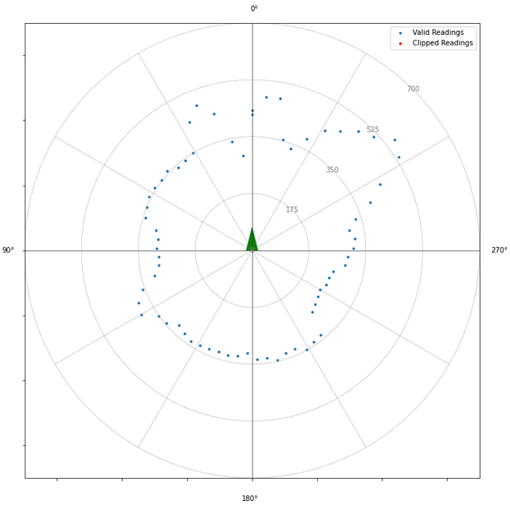
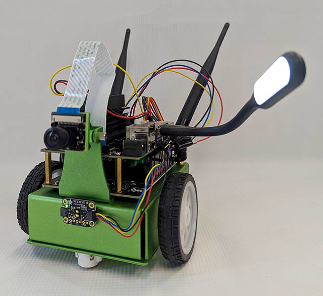

# Robotic Exploration with Jetson Nano
Author: Jesse Flot, Carnegie Mellon Robotics Academy

## Overview
This project focuses on using the Jetson Nano for robotic exploration, leveraging a camera and a distance sensor. The goal is to help students understand how robot sensors capture information from the world and how AI models like MobileNet and DepthNet can process this data into meaningful perception.

## Components

* Jetson Nano
* Jetbot
* CSI Camera
* VL53L1X Distance Sensor
* USB Light

## Objectives
* Understand how robots can navigate and analyze environments.
* Learn to integrate hardware components (camera and distance sensor) with the Jetson Nano.
* Apply AI models for data interpretation and environmental perception.

## Setup and Configuration
### Hardware Setup:
* Assemble the Jetbot with the Jetson Nano.
* Connect the VL53L1X distance sensor, camera, and USB light to the Jetson Nano.

### Software Requirements:
* For this project, we started with the [JetBot SD Card Image](https://jetbot.org/master/) and built the [Jetson Inference Project](https://github.com/dusty-nv/jetson-inference).
* Python libraries: smbus2, VL53L1X, cv2, ipywidgets, traitlets, jetbot, jetson_inference, jetson_utils, numpy, matplotlib.
* [Jupyter Notebook](robotic_exploration_camera_distance_data_analysis.ipynb)

### Sensor Calibration:
* Use the [VL53L1X Sensor Calibration](VL53L1X%20Sensor%20Calibration%20Test.ipynb) notebook to calibrate the distance sensor.

## Activity Description
The robot will move forward and spin to capture a series of images and distances from its environment.
The distances will generate a 2D polar grid of readings.
Images will be processed through DepthNet and MobileNet models to create depth maps and identify objects.
The robotic_exploration_camera_distance_data_analysis.ipynb notebook contains the code for this investigation.

## Exercise Resources
* [Presentation](Robotic%20Exploration%20-%20Distance%20and%20Analysis%20-%20Public.pptx): Provides a detailed overview of the exercise, its objectives, the procedures, and the technology used.
* [Jupyter Notebook](robotic_exploration_camera_distance_data_analysis.ipynb): JupyterLab Notebook that drives the data collection procedures and analysis for the exercise.
* [Graph Paper](Graph%20Paper.docx): Printable sheet for students to map their sensor data.
* [Debrief](Exercise%20Debrief.docx): Exercise reflection and analysis.

## Contributing
Your contributions to improve or extend this educational activity are welcome. Please follow the standard GitHub pull request process.

